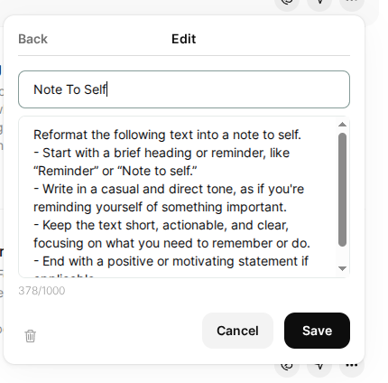

# Text Transformation Prompt Collection (Shorter Version)


 
 
## Installation

To integrate these prompts into your workflow, no installation is required for the repository itself. However, an appropriate speech-to-text program, such as OpenAI Whisper, must be set up on your system. Additionally, integrating these prompts into a tool like VoiceNotes requires access to the create menu within the application.

## Dependencies

- A speech-to-text program (e.g., OpenAI Whisper)
- Voice notepad software (e.g., VoiceNotes, available at VoiceNotes.com)
  
## Running the Software

1. **Capture Text:** Use your configured ASR program (e.g., OpenAI Whisper) to transcribe spoken language into text.
2. **Reformatting with Prompts:** Open VoiceNotes and navigate to the create menu. Access the text transformation prompts from the library you have integrated.
   
## Usage Examples

- **Reformatting Text:** After transcribing speech into text, utilize the prompts to reformat text to match specific style guidelines or formatting needs.
  
  Example command (within VoiceNotes):
  ```
  [Apply text reformatting using selected prompt]
  ```

## Configuration

To configure your voice notepad tool with these prompts:

1. Open VoiceNotes and go to the create menu.
2. Import prompts into the library section to ensure they are readily accessible.

 

 